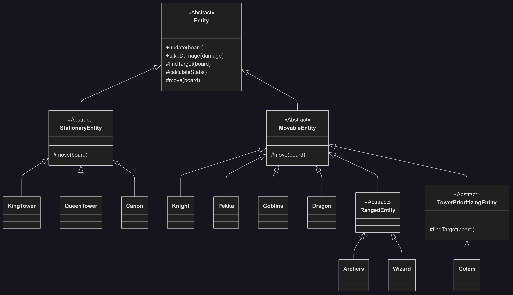

# Clash Royale Clone: Project Architecture Documentation

This document outlines the technical architecture, design patterns, and class structure of the C++ Clash Royale Clone project, providing a comprehensive overview for developers and stakeholders.

## 1. Core Philosophy

The project adheres to the following principles to ensure a robust, maintainable, and scalable codebase:

- **Object-Oriented Design**: Encapsulation and modularity are achieved by representing game components (troops, board, renderer) as distinct objects.
- **Separation of Concerns**: Game logic (`Game`), entity behavior (`Entity` subclasses), and rendering (`Renderer`) are handled by separate components.
- **Testability**: The system is designed for testability, using techniques like testing subclasses to verify internal logic without compromising encapsulation.
- **Modern C++**: Leverages features like smart pointers (`std::shared_ptr`), `virtual` functions for polymorphism, and a structured class hierarchy.

## 2. Directory Structure

The project follows a professional directory layout to separate interfaces from implementations:

- **`include/`**: Contains public-facing header files (`.hpp`).
  - `core/`: Headers for core systems (`Game`, `Board`, `EntityFactory`).
  - `entity/`: Headers for the base `Entity` class and its subclasses (e.g., `Knight.hpp`, `Dragon.hpp`).
- **`src/`**: Contains implementation source files (`.cpp`).
  - `core/`: Implementations for core game systems.
  - `entity/`: Implementations for entity classes.
- **`test/`**: Contains unit test source files using the Google Test framework.
- **`CMakeLists.txt`**: Root build script defining targets, dependencies, and project settings.

## 3. Class Hierarchy and Design

The entity system is the core of the project, built with a clear inheritance hierarchy to promote code reuse and specialization.

### 3.1 Entity Class Hierarchy 

### 3.2 Class Descriptions

- **Entity (Abstract Base Class)**: Defines the common interface for all game objects with pure virtual functions for `calculateStats()` and `move()`, ensuring subclasses implement specific behaviors.
- **Abstract Subclasses**:
  - `MovableEntity`: Base for troops that can move, implementing standard "move towards target" logic.
  - `StationaryEntity`: Base for buildings, with an empty `move()` method to prevent movement.
  - `RangedEntity`: Extends `MovableEntity` for troops that attack from a distance, with potential for range-specific logic.
  - `TowerPrioritizingEntity`: Extends `MovableEntity`, overriding `findTarget()` to prioritize buildings (e.g., Golem).
- **Concrete Classes**: Troops (e.g., `Knight`, `Dragon`) and buildings (e.g., `KingTower`, `Canon`) inherit from appropriate base classes, providing specific stats and behaviors.

### 3.3 Key Design Patterns

- **Factory Pattern (`EntityFactory`)**: Decouples game logic from concrete entity creation. The `Game` class uses `EntityFactory` to create troops based on `EntityType`, enabling easy addition of new troops.
- **Template Method Pattern**: The `Entity::update()` method defines a skeleton algorithm (check timer, then move), with subclasses overriding the `move()` step for specific behaviors (e.g., straight, diagonal, zigzag).
- **Testing Subclass Pattern**: A `TestableGame` subclass exposes protected methods (e.g., `updateElixir()`, `runAI()`) for unit testing, preserving encapsulation of the main `Game` class.

## 4. Build and Test System

- **CMake**: Manages the build process, creating a static library (`clash_royale_lib`) for core logic, linked to the main executable (`run`) and test executable (`run_tests`). This ensures scalability and efficiency.
- **Google Test**: Unit tests use the Google Test framework, automatically configured via CMake’s `FetchContent`. Tests are executed using the `ctest` command, ensuring seamless dependency management and test execution.

