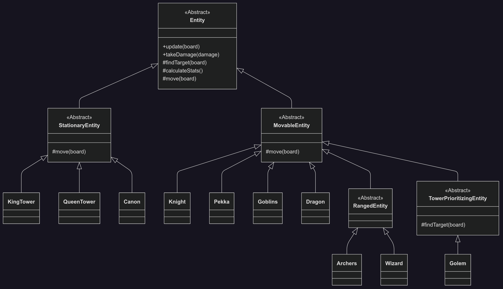

# Clash Royale Clone: Project Architecture Documentation

This document outlines the technical architecture, design patterns, and class structure of the C++ Clash Royale Clone project, providing a comprehensive overview for developers and stakeholders.

## 1. Core Philosophy

The project adheres to the following principles to ensure a robust, maintainable, and scalable codebase:

- **Object-Oriented Design**: Encapsulation and modularity are achieved by representing game components (troops, board, renderer) as distinct objects.
- **Separation of Concerns**: Game logic (`Game`), entity behavior (`Entity` subclasses), and rendering (`Renderer`) are handled by separate components.
- **Testability**: The system is designed for testability, using techniques like testing subclasses to verify internal logic without compromising encapsulation.
- **Modern C++**: Leverages features like smart pointers (`std::shared_ptr`), `virtual` functions for polymorphism, and a structured class hierarchy.

## 2. Directory Structure

The project follows a professional directory layout to separate interfaces from implementations:

Everything is under the `cr` namespace, and public headers are rooted at
`include/clash_royale/` so downstream includes are unambiguous.

- **`include/clash_royale/`**: Public headers.
  - `core/`: Shared vocabulary with no dependencies (`Lane`, `EntityType`, arena dimensions).
  - `sim/`: The simulation -- `Entity` and its subclasses, `Board`, `EntityFactory`.
  - `tui/`: The terminal front-end -- `Renderer`, `InputHandler`, `Game`.
- **`src/`**: Implementations, mirroring the header layout.
- **`apps/tui/`**: The playable terminal game, a thin `main` over `cr_tui`.
- **`tests/`**: Unit and characterization tests using GoogleTest.
- **`cmake/`**: The package-config template used to generate `ClashRoyaleConfig.cmake`.
- **`CMakeLists.txt`**: Root build script defining targets, options and install rules.

### 2.1 Layering

`core` depends on nothing, `sim` depends on `core`, and `tui` depends on both.
Nothing flows the other way. Two inversions in the original layout have been
removed: entities previously read arena dimensions off the `Renderer`, and
`EntityFactory` included the whole `Game` header merely to see `Lane` -- which
dragged `<termios.h>` into most of the simulation. Both are now impossible,
because `cr_core` is a separate build target that CI compiles with the
front-end switched off.

`Game` is now a front-end and nothing more: it owns a `Simulation`, polls the
keyboard, draws frames and paces itself. Every match rule lives in `cr_core`, so
the whole test suite builds and runs with the front-end switched off -- which CI
checks on every push.

## 3. Class Hierarchy and Design

The entity system is the core of the project, built with a clear inheritance hierarchy to promote code reuse and specialization.

### 3.1 Entity Class Hierarchy 

### 3.2 Class Descriptions

- **Entity (Abstract Base Class)**: Defines the common interface for all game objects with pure virtual functions for `calculateStats()` and `move()`, ensuring subclasses implement specific behaviors.
- **Abstract Subclasses**:
  - `MovableEntity`: Base for troops that can move, implementing standard "move towards target" logic.
  - `StationaryEntity`: Base for buildings, with an empty `move()` method to prevent movement.
  - `RangedEntity`: Extends `MovableEntity` for troops that attack from a distance, with potential for range-specific logic.
  - `TowerPrioritizingEntity`: Extends `MovableEntity`, overriding `findTarget()` to prioritize buildings (e.g., Golem).
- **Concrete Classes**: Troops (e.g., `Knight`, `Dragon`) and buildings (e.g., `KingTower`, `Canon`) inherit from appropriate base classes, providing specific stats and behaviors.

### 3.3 Key Design Patterns

- **Factory Pattern (`EntityFactory`)**: Decouples game logic from concrete entity creation. The `Game` class uses `EntityFactory` to create troops based on `EntityType`, enabling easy addition of new troops.
- **Template Method Pattern**: The `Entity::update()` method defines a skeleton algorithm (check timer, then move), with subclasses overriding the `move()` step for specific behaviors (e.g., straight, diagonal, zigzag).
- **Headless Core**: `Simulation` owns every match rule -- the board, both elixir
  pools, the clock, the win condition and the random generator -- and performs no
  I/O. `step(dt)` advances it by an explicit time delta, so it can be driven by
  the terminal front-end, a test, a bot or a training harness at any rate. The
  `TestableGame` subclass that previously existed to reach `Game`'s protected
  methods is gone: there is nothing left to reach around, because the logic is
  public on a class that needs no terminal.
- **Strategy Pattern (`AiController`)**: Opponents implement a single `update()`
  method and act only through `Simulation`'s public interface, so a custom AI
  cannot cheat. `RandomAiController` is the default and the reference example.
- **Determinism**: randomness comes from a `cr::Rng` (`std::mt19937`) owned by
  the simulation, not global `std::rand()`. A `MatchConfig` seed therefore
  replays a match exactly, on any platform, and two simulations in one process
  cannot perturb each other.

## 4. Build and Test System

- **CMake**: Builds two static libraries -- `cr_core` (simulation) and the optional `cr_tui` (terminal front-end) -- exported as `ClashRoyale::core` and `ClashRoyale::tui`. These link into the `clash_royale` executable and the `run_tests` suite. Install rules and a generated `ClashRoyaleConfig.cmake` let downstream projects consume the library through `find_package`.
- **Google Test**: Unit tests use the Google Test framework, automatically configured via CMake’s `FetchContent`. Tests are executed using the `ctest` command, ensuring seamless dependency management and test execution.

