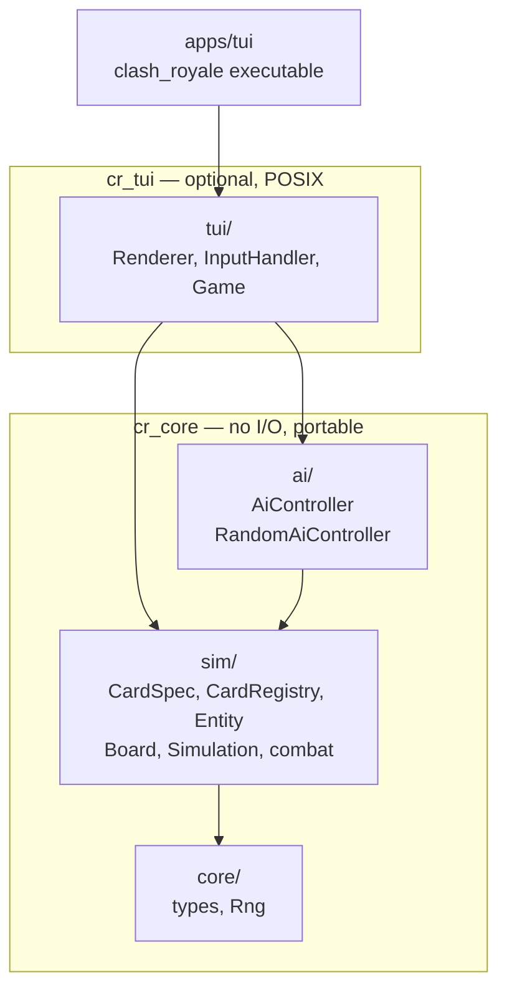
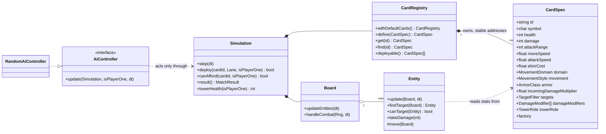
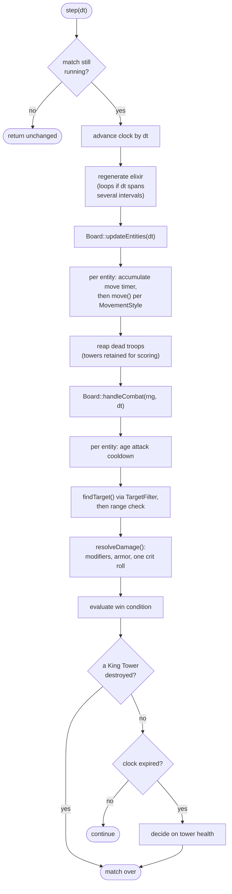

# Clash Royale Clone: Project Architecture Documentation

This document outlines the technical architecture, design patterns, and class structure of the C++ Clash Royale Clone project, providing a comprehensive overview for developers and stakeholders.

## 1. Core Philosophy

The project adheres to the following principles to ensure a robust, maintainable, and scalable codebase:

- **Object-Oriented Design**: Encapsulation and modularity are achieved by representing game components (troops, board, renderer) as distinct objects.
- **Separation of Concerns**: Game logic (`Game`), entity behavior (`Entity` subclasses), and rendering (`Renderer`) are handled by separate components.
- **Testability**: The system is designed for testability, using techniques like testing subclasses to verify internal logic without compromising encapsulation.
- **Modern C++**: Leverages features like smart pointers (`std::shared_ptr`), `virtual` functions for polymorphism, and a structured class hierarchy.

## 2. Directory Structure

The project follows a professional directory layout to separate interfaces from implementations:

Everything is under the `cr` namespace, and public headers are rooted at
`include/clash_royale/` so downstream includes are unambiguous.

- **`include/clash_royale/`**: Public headers.
  - `core/`: Shared vocabulary with no dependencies (`Lane`, `EntityType`, arena dimensions).
  - `sim/`: The simulation -- `Entity` and its subclasses, `Board`, `EntityFactory`.
  - `tui/`: The terminal front-end -- `Renderer`, `InputHandler`, `Game`.
- **`src/`**: Implementations, mirroring the header layout.
- **`apps/tui/`**: The playable terminal game, a thin `main` over `cr_tui`.
- **`tests/`**: Unit and characterization tests using GoogleTest.
- **`cmake/`**: The package-config template used to generate `ClashRoyaleConfig.cmake`.
- **`CMakeLists.txt`**: Root build script defining targets, options and install rules.

### 2.1 Layering

`core` depends on nothing, `sim` depends on `core`, and `tui` depends on both.
Nothing flows the other way. Two inversions in the original layout have been
removed: entities previously read arena dimensions off the `Renderer`, and
`EntityFactory` included the whole `Game` header merely to see `Lane` -- which
dragged `<termios.h>` into most of the simulation. Both are now impossible,
because `cr_core` is a separate build target that CI compiles with the
front-end switched off.

`Game` is now a front-end and nothing more: it owns a `Simulation`, polls the
keyboard, draws frames and paces itself. Every match rule lives in `cr_core`, so
the whole test suite builds and runs with the front-end switched off -- which CI
checks on every push.

## 3. Cards, Entities and Design

### 3.1 Cards are data

A unit is a `CardSpec` value: its stats, elixir cost, armor class, movement
style, target filter and damage modifiers. Cards live in a `CardRegistry`, keyed
by a string id, and `MatchConfig::cards` decides which roster a match uses.

Adding a unit used to mean editing five places -- a new header, a new source
file, the `EntityType` enum, the factory switch, and both damage-modifier
switches in the damage calculation. None of those were reachable from outside
the library, so a downstream project could not add a card without forking. A
card is now registered from outside:

```cpp
cr::CardSpec harpy;
harpy.id = "harpy";
harpy.health = 240;
harpy.damage = 30;
harpy.domain = cr::MovementDomain::Air;
harpy.targets = cr::TargetFilter{/*ground=*/true, /*air=*/true};
harpy.damageModifiers = {cr::DamageModifier{2.0f, {cr::ArmorClass::Heavy}}};

cr::MatchConfig config;
config.cards.define(harpy);
cr::Simulation sim{config};
sim.deploy("harpy", cr::Lane::LEFT, /*isPlayerOne=*/true);
```

The `EntityType` enum is gone. A closed enumeration could not name a card
defined downstream, and any code switching on one was incomplete by
construction -- which is exactly what the two damage switches were. Built-in
ids are available as constants in `sim/default_cards.hpp`.

### 3.2 Entity is concrete

`Entity` reads its stats from the spec it was built with. The hierarchy that
used to sit above it is gone:

- Ten classes (`Knight`, `Golem`, `Pekka`, ...) existed only to assign five
  numbers in `calculateStats()`. Those numbers are now rows in the card table.
- `MovableEntity`, `StationaryEntity` and `RangedEntity` selected a movement
  policy. That is now `CardSpec::movement`, a `MovementStyle`.
- `TowerPrioritizingEntity` overrode targeting so the Golem would ignore
  troops. That is now `TargetFilter::buildingsOnly`.

Twenty-nine files were deleted in the process, with no change in behavior.

`Entity` is still polymorphic: `update()`, `move()` and `findTarget()` remain
virtual, and `CardSpec::factory` lets a card supply its own subclass. That is
the escape hatch for behavior that genuinely cannot be described as data -- data
covers the common case, and subclassing stays available for the rest.

### 3.3 Key Design Patterns

- **Data-Driven Cards (`CardRegistry`)**: the library's extension point.
  Registered specs are stored at stable addresses, so the `const CardSpec&` an
  entity holds stays valid as further cards are defined.
- **Headless Core**: `Simulation` owns every match rule -- the board, both
  elixir pools, the clock, the win condition and the random generator -- and
  performs no I/O. `step(dt)` advances it by an explicit time delta, so it can
  be driven by the terminal front-end, a test, a bot or a training harness at
  any rate.
- **Strategy Pattern (`AiController`)**: opponents implement a single
  `update()` method and act only through `Simulation`'s public interface, so a
  custom AI cannot cheat. `RandomAiController` reads its roster from the
  registry, so it picks up downstream cards automatically.
- **Determinism**: randomness comes from a `cr::Rng` (`std::mt19937`) owned by
  the simulation, not global `std::rand()`. A `MatchConfig` seed therefore
  replays a match exactly, on any platform, and two simulations in one process
  cannot perturb each other.
- **Single Source of Targeting**: `Entity::canTarget` is consulted by both
  movement and combat. Those previously held independent copies of the policy,
  which is why the Golem's preference had to be special-cased in each.

### 3.4 Diagrams

GitHub renders these inline; `Architecture_diagram.png` showed the entity
hierarchy that no longer exists and has been retired in favour of them.

**Module layering.** Arrows point from a module to what it depends on. Nothing
points upward, which is what lets `cr_core` build with the front-end switched
off.


```mermaid
graph TD
    subgraph tui_target["cr_tui &mdash; optional, POSIX"]
        TUI["tui/<br/>Renderer, InputHandler, Game"]
    end
    subgraph core_target["cr_core &mdash; no I/O, portable"]
        AI["ai/<br/>AiController<br/>RandomAiController"]
        SIM["sim/<br/>CardSpec, CardRegistry, Entity<br/>Board, Simulation, combat"]
        CORE["core/<br/>types, Rng"]
    end

    APP["apps/tui<br/>clash_royale executable"] --> TUI
    TUI --> SIM
    TUI --> AI
    AI --> SIM
    SIM --> CORE
```

**The card model.** A `CardSpec` is the unit of extension; an `Entity` reads
its stats from one rather than hardcoding them in a subclass.


```mermaid
classDiagram
    direction LR

    class CardSpec {
        +string id
        +char symbol
        +int health
        +int damage
        +int attackRange
        +float moveSpeed
        +float attackSpeed
        +float elixirCost
        +MovementDomain domain
        +MovementStyle movement
        +ArmorClass armor
        +float incomingDamageMultiplier
        +TargetFilter targets
        +DamageModifier[] damageModifiers
        +TowerRole towerRole
        +factory
    }

    class CardRegistry {
        +withDefaultCards() CardRegistry
        +define(CardSpec) CardSpec
        +get(id) CardSpec
        +find(id) CardSpec
        +deployable() CardSpec[]
    }

    class Entity {
        +update(Board, dt)
        +findTarget(Board) Entity
        +canTarget(Entity) bool
        +takeDamage(int)
        #move(Board)
    }

    class Board {
        +updateEntities(dt)
        +handleCombat(Rng, dt)
    }

    class Simulation {
        +step(dt)
        +deploy(cardId, Lane, isPlayerOne) bool
        +canAfford(cardId, isPlayerOne) bool
        +result() MatchResult
        +towerHealth(isPlayerOne) int
    }

    class AiController {
        <<interface>>
        +update(Simulation, isPlayerOne, dt)
    }

    class RandomAiController

    CardRegistry "1" *-- "many" CardSpec : owns, stable addresses
    Entity ..> CardSpec : reads stats from
    Board "1" o-- "many" Entity
    Simulation *-- Board
    Simulation *-- CardRegistry
    RandomAiController ..|> AiController
    AiController ..> Simulation : acts only through
```

**One simulation step.** `step(dt)` is the whole match loop; a front-end adds
only input and rendering around it.


```mermaid
flowchart TD
    START(["step(dt)"]) --> RUNNING{"match still<br/>running?"}
    RUNNING -- no --> NOOP(["return unchanged"])
    RUNNING -- yes --> CLOCK["advance clock by dt"]
    CLOCK --> ELIXIR["regenerate elixir<br/>(loops if dt spans<br/>several intervals)"]
    ELIXIR --> ENTITIES["Board::updateEntities(dt)"]
    ENTITIES --> MOVE["per entity: accumulate move timer,<br/>then move() per MovementStyle"]
    MOVE --> REAP["reap dead troops<br/>(towers retained for scoring)"]
    REAP --> COMBAT["Board::handleCombat(rng, dt)"]
    COMBAT --> COOL["per entity: age attack cooldown"]
    COOL --> TARGET["findTarget() via TargetFilter,<br/>then range check"]
    TARGET --> DMG["resolveDamage():<br/>modifiers, armor, one crit roll"]
    DMG --> WIN["evaluate win condition"]
    WIN --> KING{"a King Tower<br/>destroyed?"}
    KING -- yes --> OVER(["match over"])
    KING -- no --> TIME{"clock expired?"}
    TIME -- yes --> TIEBREAK["decide on tower health"]
    TIEBREAK --> OVER
    TIME -- no --> CONT(["continue"])
```

## 4. Build and Test System

- **CMake**: Builds two static libraries -- `cr_core` (simulation) and the optional `cr_tui` (terminal front-end) -- exported as `ClashRoyale::core` and `ClashRoyale::tui`. These link into the `clash_royale` executable and the `run_tests` suite. Install rules and a generated `ClashRoyaleConfig.cmake` let downstream projects consume the library through `find_package`.
- **Google Test**: Unit tests use the Google Test framework, automatically configured via CMake’s `FetchContent`. Tests are executed using the `ctest` command, ensuring seamless dependency management and test execution.

