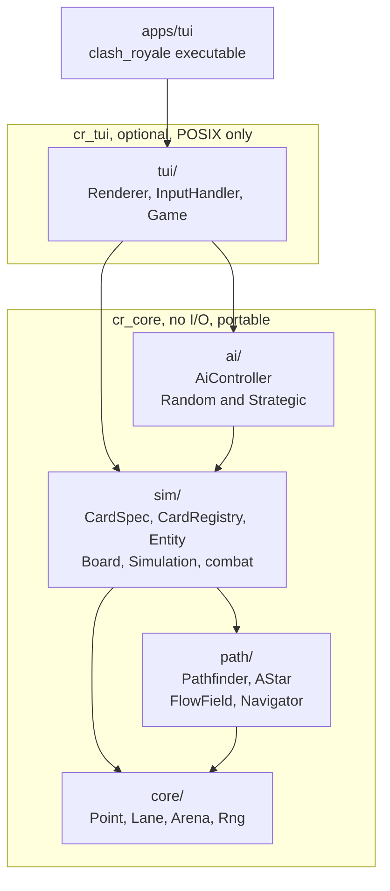
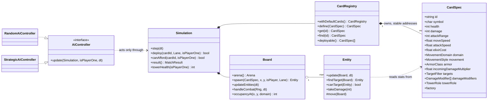
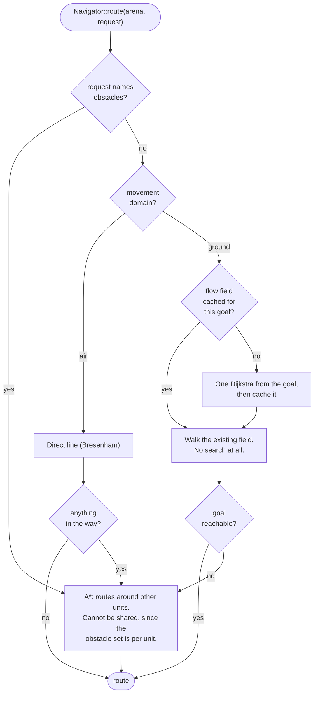
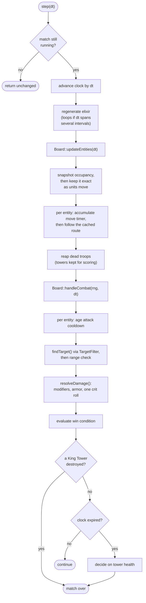

# Architecture

How the project is put together, and why. The README covers using it; this
covers the shape of it.

## 1. What drives the design

- **The simulation does no I/O.** Every match rule lives in a library that has
  never heard of a terminal. The playable game is one front-end over it, and a
  bot or a test is another. This is also what makes the suite fast: it drives
  the simulation directly instead of a game loop.
- **Data over code where data is enough.** Troops are values in a registry
  rather than classes. That is what lets a project using the library add a unit
  without forking it.
- **Reproducible by default.** Randomness comes from a generator the simulation
  owns. A seed replays a match exactly, which makes bugs reportable and
  balance measurable.
- **Layers that cannot leak.** The dependency direction is enforced by the
  build, not by convention, so it is checked on every push rather than
  remembered.

## 2. Directory structure

Everything is under the `cr` namespace, and public headers are rooted at
`include/clash_royale/` so a downstream include is unambiguous.

- **`include/clash_royale/`**: public headers.
  - `core/`: the shared vocabulary. `Point`, `Lane`, `MovementDomain`, the
    `Arena` and its terrain, and `Rng`. Depends on nothing.
  - `sim/`: the simulation. `CardSpec` and `CardRegistry`, `Entity`, `Board`,
    damage resolution, and `Simulation`.
  - `path/`: routing. The `Pathfinder` interface, A\*, flow fields, the direct
    line, and the `Navigator` that chooses between them.
  - `ai/`: the `AiController` interface and the two implementations.
  - `tui/`: the terminal front-end. `Renderer`, `InputHandler`, `Game`.
- **`src/`**: implementations, mirroring the header layout.
- **`apps/tui/`**: the playable game, a thin `main` over `cr_tui`.
- **`examples/`**: a headless match, and adding a card from outside the library.
- **`benchmarks/`**: the pathfinding comparison.
- **`tests/`**: unit and characterization tests.
- **`cmake/`**: the template used to generate `ClashRoyaleConfig.cmake`.

### 2.1 Layering

`core` depends on nothing. `sim` and `path` depend on `core`. `ai` depends on
`sim`. `tui` depends on all of them. Nothing points the other way.

Two inversions in the original layout are gone. Entities used to read the arena
dimensions off the `Renderer`, so the simulation depended on the view. And the
entity factory included the whole `Game` header just to see `Lane`, which
dragged `<termios.h>` into most of the simulation and made it uncompilable
anywhere without a POSIX terminal. Both are now impossible to reintroduce,
because `cr_core` is a separate build target that CI compiles with the front-end
switched off, and because CI also checks that no header under `core`, `sim`,
`path` or `ai` can reach anything under `tui`.

`Game` is a front-end and nothing else now: it owns a `Simulation`, polls the
keyboard, draws frames, and paces itself with a sleep. It used to hold the match
state too, and exposed five protected virtuals purely so a test subclass could
reach them. Those are gone, because the logic they guarded is public on a class
that needs no terminal.

## 3. Cards and entities

### 3.1 Cards are data

A unit is a `CardSpec` value: stats, elixir cost, armor class, movement style,
target filter and damage modifiers. Cards live in a `CardRegistry`, keyed by a
string id, and `MatchConfig::cards` decides which roster a match uses.

Adding a unit used to mean editing five places: a new header, a new source file,
the `EntityType` enum, the factory switch, and both damage-modifier switches in
the damage calculation. None of those were reachable from outside the library,
so a project using it could not add a card without forking. A card is now
registered from outside:

```cpp
cr::CardSpec harpy;
harpy.id = "harpy";
harpy.health = 240;
harpy.damage = 30;
harpy.domain = cr::MovementDomain::Air;
harpy.targets = cr::TargetFilter{/*ground=*/true, /*air=*/true};
harpy.damageModifiers = {
    cr::DamageModifier{.multiplier = 2.0f, .againstArmor = {cr::ArmorClass::Heavy}},
};

cr::MatchConfig config;
config.cards.define(harpy);
cr::Simulation sim{config};
sim.deploy("harpy", cr::Lane::LEFT, /*isPlayerOne=*/true);
```

The `EntityType` enum is gone. A closed enumeration cannot name a card defined
downstream, and any code switching on one is incomplete by construction, which
is exactly what the two damage switches were. Built-in ids are available as
constants in `sim/default_cards.hpp`.

Specs are stored at stable addresses, in a `std::deque` rather than a `vector`,
because an `Entity` holds a `const CardSpec&` and that reference has to survive
later registrations.

### 3.2 Entity is concrete

`Entity` reads its stats from the spec it was built with. The hierarchy that
used to sit above it is gone:

- Ten classes (`Knight`, `Golem`, `Pekka` and so on) existed only to assign
  five numbers in `calculateStats()`. Those numbers are rows in the card table
  now.
- `MovableEntity`, `StationaryEntity` and `RangedEntity` selected a movement
  policy. That is `CardSpec::movement`, a `MovementStyle`.
- `TowerPrioritizingEntity` overrode targeting so the Golem would ignore
  troops. That is `TargetFilter::buildingsOnly`.

Twenty-nine files went away in the process, with no change in behavior.

`Entity` is still polymorphic. `update()`, `move()` and `findTarget()` are
virtual, and `CardSpec::factory` lets a card supply its own subclass. Data
covers the common case and subclassing is there for the rest.

### 3.3 Targeting lives in one place

`Entity::canTarget` answers whether one unit is willing to attack another, from
the card's `TargetFilter`. Both movement and combat go through it.

They used to hold separate copies of that policy, which is why the Golem's
buildings-only preference had to be special-cased twice, once in `findTarget`
and once in the combat loop. Combat now asks `findTarget` for the nearest
admissible enemy and range-checks the answer, which is equivalent and leaves one
definition of the rule.

### 3.4 Damage

`resolveDamage` takes the attacker's base damage, applies the matchup
multipliers from its `damageModifiers`, scales by the target's
`incomingDamageMultiplier` for armor, and then rolls at most one critical hit.

A `DamageModifier` applies when every condition it names matches. Conditions
left empty match anything, so a modifier with none always applies. They can
match an armor class, a movement domain, a set of card ids, or whether the
target is a building.

`matchupMultiplier` is public because the strategic AI needs the same answer
combat does when weighing a counter, and reimplementing the matching rules would
let the two drift apart.

## 4. The arena

`Arena` owns the field's extent and its terrain. A `Tile` is `Ground`, `Water`,
`Bridge` or `Blocked`. Ground units are stopped by water and blocked tiles, air
units only by blocked ones, and the one-tile border is blocked so the interior
check and the movement clamp cannot disagree.

The shipped arena is 40 by 35, with a river along the midline and a three-tile
bridge in each lane, centred on the lane spawn columns so a unit deployed in a
lane is already lined up with its crossing.

The river is one row wide, which is forced rather than chosen. Rows 16 and 18
are where the two Canons spawn, so widening it either way would drop a building
into the water. A test asserts that no tower, troop spawn or Canon spawn lands
on water, so that constraint cannot be broken quietly.

Terrain is what gives `Lane` a purpose. Before it existed, a lane was recorded
on every entity and read by nothing, because the field was wide open and units
walked at whatever was nearest.

The tower layout is mirrored about both axes. It did not used to be: player
two's towers sat 14 and 12 rows from the midline while player one's sat 10 and
8, so one side's towers were four tiles more exposed and the other side had a
shorter run at them. Two identical random opponents gave player one 58% of
matches. After mirroring, the split is decided only by which controller the
caller updates first.

## 5. Routing

`Navigator` chooses a strategy per request. The division is the one RTS engines
settle on: a global route over static terrain that many units can share, plus
local avoidance for the things that move.

- **Air** takes the straight line, falling back to a search if something
  actually blocks it. Fliers cross water freely, so searching for them is
  usually wasted work, and the line is about thirty times cheaper.
- **Ground** takes the shared flow field for its goal. The field is built from
  terrain only, deliberately. One that accounted for unit positions would be
  stale the moment anything moved, and rebuilding it every tick would throw away
  the sharing that makes it worth having.
- **A request that names obstacles** gets A\*, which routes around them. This is
  the escape hatch for a unit that local avoidance has left hemmed in.

`AStarPathfinder` is eight-directional with an octile heuristic. A diagonal step
costs the square root of two and the heuristic matches, so it stays admissible
on an eight-connected grid; Manhattan distance would overestimate and could
return a longer route. A diagonal move is refused when either orthogonal
neighbour is blocked, so a unit cannot slip through the corner between the end
of a bridge and the water beside it. The flow field uses the same corner rule,
so the two agree about what is walkable and a unit is never handed a route the
other would reject.

Its scratch state is flat, indexed by `y * width + x` rather than hashed by
coordinate, and reused between calls. Rather than clearing it per search, each
entry records the generation it was written in, so a stale entry is recognised
instead of erased. A search then costs what it expands rather than the size of
the arena.

Routes are cached on the entity. They are recomputed when the route runs out,
when the target drifts more than a couple of tiles from where the route was
aimed, or when a repath timer fires. The timer is seeded from the spawn
position, so a wave of units deployed together does not all repath on the same
step.

Collision is counted per domain, so a flier and a ground troop do not block each
other, and buildings occupy their tile so troops walk around them. The count is
snapshotted at the start of `updateEntities` and then kept exact as each entity
moves. Snapshotting alone was not enough: two units both saw a tile as free and
stepped into it on the same tick.

## 6. Opponents

`AiController` has one method, `update(Simulation&, bool isPlayerOne, float dt)`.
A controller acts only through `Simulation`'s public interface, so a custom one
cannot see or do anything a player could not.

`RandomAiController` plays a random affordable card down a random lane as soon
as it can. It reacts to nothing, and exists as a baseline and as the simplest
example of the interface.

`StrategicAiController` makes three decisions: whether there is anything to
defend against, what actually counters it, and whether it is worth attacking
yet. It scores candidate defenders by how much of the incoming push they can
engage, weighted by how dangerous each part of it is; it counts the troops and
towers already covering a threat and adds nothing once they outweigh it; and it
banks elixir until a push is worth making.

Everything it knows comes from `CardSpec` data, so it plays a roster it has
never seen. A custom flier registers as an air threat because its domain says
so, and a custom anti-air card registers as a counter because its target filter
says so. An AI that named the built-in cards would be useless to anyone who
added their own, which is the whole point of the registry.

It wins about 82% of seeded matches against the random controller from either
side. It wins by defending: it finishes with its own towers markedly healthier
while dealing slightly less damage than random play, because it banks elixir and
answers pushes rather than trading blindly.

Its tuning weights came from sweeping each one and validating on seeds it was
not tuned on. Two results contradicted the reasoning behind them. Weighting the
controller to prefer a card that ignores troops and heads for towers sounds
right, and costs fourteen points of win rate, because the shipped roster's
tower-focused card is slow and low-damage, so arriving is not enough. And
defending below parity with the incoming push beats matching it.

It draws no randomness at all, so two instances playing each other produce the
same match every time, decided by which one the caller updates first. For a
mirror match, alternate the update order or give the two instances different
`Tuning`.

## 7. Determinism

`cr::Rng` wraps `std::mt19937`, and the simulation owns one. It replaced global
`std::rand()`, which was a problem three ways: it is process-global mutable
state, so two simulations in one process perturbed each other; its sequence is
implementation-defined, so a seeded test produced different numbers on glibc
than on libc++; and nothing was reproducible. Because `mt19937` is specified by
the standard, a seed means the same thing everywhere, and tests assert exact
damage values rather than ranges.

`Rng::fromEntropy()` covers the case where reproducibility is not wanted, and
still reports the seed it chose, so a session can be replayed afterwards.

## 8. Diagrams

GitHub renders these inline. `Architecture_diagram.png` showed the entity
hierarchy that no longer exists and has been retired in favour of them.

**Module layering.** Arrows point from a module to what it depends on. Nothing
points upward, which is what lets `cr_core` build with the front-end switched
off.


```mermaid
graph TD
    subgraph tui_target["cr_tui, optional, POSIX only"]
        TUI["tui/<br/>Renderer, InputHandler, Game"]
    end
    subgraph core_target["cr_core, no I/O, portable"]
        AI["ai/<br/>AiController<br/>Random and Strategic"]
        PATH["path/<br/>Pathfinder, AStar<br/>FlowField, Navigator"]
        SIM["sim/<br/>CardSpec, CardRegistry, Entity<br/>Board, Simulation, combat"]
        CORE["core/<br/>Point, Lane, Arena, Rng"]
    end

    APP["apps/tui<br/>clash_royale executable"] --> TUI
    TUI --> SIM
    TUI --> AI
    AI --> SIM
    SIM --> PATH
    SIM --> CORE
    PATH --> CORE
```

**The card model.** A `CardSpec` is the unit of extension, and an `Entity` reads
its stats from one rather than hardcoding them in a subclass.


```mermaid
classDiagram
    direction LR

    class CardSpec {
        +string id
        +char symbol
        +int health
        +int damage
        +int attackRange
        +float moveSpeed
        +float attackSpeed
        +float elixirCost
        +MovementDomain domain
        +MovementStyle movement
        +ArmorClass armor
        +float incomingDamageMultiplier
        +TargetFilter targets
        +DamageModifier[] damageModifiers
        +TowerRole towerRole
        +factory
    }

    class CardRegistry {
        +withDefaultCards() CardRegistry
        +define(CardSpec) CardSpec
        +get(id) CardSpec
        +find(id) CardSpec
        +deployable() CardSpec[]
    }

    class Entity {
        +update(Board, dt)
        +findTarget(Board) Entity
        +canTarget(Entity) bool
        +takeDamage(int)
        #move(Board)
    }

    class Board {
        +arena() Arena
        +spawn(CardSpec, x, y, isPlayer, Lane) Entity
        +updateEntities(dt)
        +handleCombat(Rng, dt)
        +occupancyAt(x, y, domain) int
    }

    class Simulation {
        +step(dt)
        +deploy(cardId, Lane, isPlayerOne) bool
        +canAfford(cardId, isPlayerOne) bool
        +result() MatchResult
        +towerHealth(isPlayerOne) int
    }

    class AiController {
        <<interface>>
        +update(Simulation, isPlayerOne, dt)
    }

    class RandomAiController
    class StrategicAiController

    CardRegistry "1" *-- "many" CardSpec : owns, stable addresses
    Entity ..> CardSpec : reads stats from
    Board "1" o-- "many" Entity
    Simulation *-- Board
    Simulation *-- CardRegistry
    RandomAiController ..|> AiController
    StrategicAiController ..|> AiController
    AiController ..> Simulation : acts only through
```

**Routing.** How a movement request is answered, and why sharing matters.


```mermaid
flowchart TD
    REQ(["Navigator::route(arena, request)"]) --> OBST{"request names<br/>obstacles?"}
    OBST -- yes --> ASTAR["A*: routes around other units.<br/>Cannot be shared, since the<br/>obstacle set is per unit."]
    OBST -- no --> DOMAIN{"movement<br/>domain?"}
    DOMAIN -- air --> LINE["Direct line (Bresenham)"]
    LINE --> BLOCKED{"anything<br/>in the way?"}
    BLOCKED -- no --> DONE(["route"])
    BLOCKED -- yes --> ASTAR
    DOMAIN -- ground --> FIELD{"flow field<br/>cached for<br/>this goal?"}
    FIELD -- yes --> WALK["Walk the existing field.<br/>No search at all."]
    FIELD -- no --> BUILD["One Dijkstra from the goal,<br/>then cache it"]
    BUILD --> WALK
    WALK --> REACH{"goal<br/>reachable?"}
    REACH -- yes --> DONE
    REACH -- no --> ASTAR
    ASTAR --> DONE
```

**One simulation step.** `step(dt)` is the whole match loop. A front-end adds
only input and rendering around it.


```mermaid
flowchart TD
    START(["step(dt)"]) --> RUNNING{"match still<br/>running?"}
    RUNNING -- no --> NOOP(["return unchanged"])
    RUNNING -- yes --> CLOCK["advance clock by dt"]
    CLOCK --> ELIXIR["regenerate elixir<br/>(loops if dt spans<br/>several intervals)"]
    ELIXIR --> ENTITIES["Board::updateEntities(dt)"]
    ENTITIES --> OCC["snapshot occupancy,<br/>then keep it exact<br/>as units move"]
    OCC --> MOVE["per entity: accumulate move timer,<br/>then follow the cached route"]
    MOVE --> REAP["reap dead troops<br/>(towers kept for scoring)"]
    REAP --> COMBAT["Board::handleCombat(rng, dt)"]
    COMBAT --> COOL["per entity: age attack cooldown"]
    COOL --> TARGET["findTarget() via TargetFilter,<br/>then range check"]
    TARGET --> DMG["resolveDamage():<br/>modifiers, armor, one crit roll"]
    DMG --> WIN["evaluate win condition"]
    WIN --> KING{"a King Tower<br/>destroyed?"}
    KING -- yes --> OVER(["match over"])
    KING -- no --> TIME{"clock expired?"}
    TIME -- yes --> TIEBREAK["decide on tower health"]
    TIEBREAK --> OVER
    TIME -- no --> CONT(["continue"])
```

## 9. Build and test

CMake builds two static libraries, `cr_core` and the optional `cr_tui`, exported
as `ClashRoyale::core` and `ClashRoyale::tui`. They link into the
`clash_royale` executable, the `run_tests` suite, the examples and the
benchmark. Install rules and a generated `ClashRoyaleConfig.cmake` let a
downstream project consume the library through `find_package`.

Everything optional is guarded, so embedding the project does not compile
terminal code you cannot run or download GoogleTest into someone else's build.
Source lists are explicit rather than globbed, since a glob does not re-run when
a file is added.

GoogleTest arrives through `FetchContent`, only when `CR_BUILD_TESTING` is on.

CI runs build-and-test on Ubuntu and macOS, and a second job that checks four
things the test suite cannot see from inside:

- `cr_core` builds with the front-end disabled.
- Every header under `core`, `sim`, `path` and `ai` compiles on its own, and
  none of them can reach anything under `tui`. The check enumerates the headers
  rather than naming them, so it cannot go stale as they move. An earlier
  version named two headers, one of which was later deleted, and silently
  stopped checking anything.
- GoogleTest is not downloaded when `CR_BUILD_TESTING` is off.
- A separate CMake project can find the installed package, define its own card,
  and play a match with it. This one earns its keep: it caught install rules
  that listed header directories by hand and had quietly stopped shipping one.

### 9.1 Testing approach

The suite began with characterization tests, written before any refactoring, to
pin the behavior that existed. Several of those documented behavior that was
wrong. Those are named with a `Bug_` prefix and were rewritten alongside their
fixes, so each correction shows up as a visible change to a test rather than a
deletion.

Tests assert exact values where they can. That is only possible because the
simulation owns its generator: with global `rand()` the sequence differed between
standard libraries, so a damage test could only assert a range. `CombatRules`
exposes the critical-hit chance, which a test sets to zero to make damage a
single exact number.

Nothing in `tests/` links the front-end, so the whole suite runs with
`CR_BUILD_TUI=OFF`. CI checks that too, including that no front-end artifacts
are produced.
